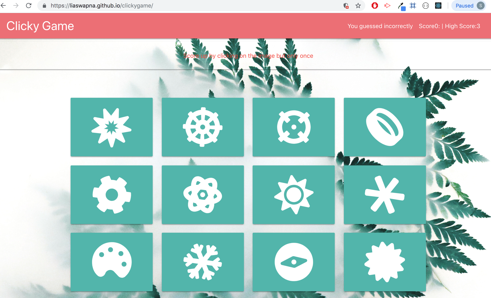

# :arrow_forward: Clicky Game

### Overview
---
The web app has 12 images which is clicked by user to play the game. In order to achieve the highest possible score, they must click each image only once. If an image is clicked twice, the game resets.

### Getting Started
---
* Clone down repo ``` git clone git@github.com:liaswapna/clickygame.git```.
* Navigate to the repo ```cd clickygame```.
* Run command ```npm install``` in Terminal or GitBash
* Run command ```npm start``` to start ther server.

### Technologies Used
---
* React
* Materialize CSS
* FontAwesome

### Dependencies
---
```js
{
    "@fortawesome/fontawesome-svg-core": "^1.2.15",
    "@fortawesome/free-solid-svg-icons": "^5.7.2",
    "@fortawesome/react-fontawesome": "^0.1.4",
    "@material-ui/core": "^3.9.2",
    "gh-pages": "^2.0.1",
    "react": "^16.8.4",
    "react-dom": "^16.8.4",
    "react-materialize": "^2.6.0",
    "react-scripts": "^2.1.8"
}
```

### Demos
---
* Clicky Game
    * [Play Game](https://liaswapna.github.io/clickygame/)

### Screenshots
---
* #### Github Pages deployed App View
    * clicky game app

      

    

